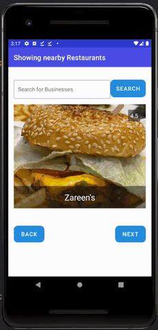

This app is developed using Architecture Components https://developer.android.com/jetpack/guide

Libraries used:
- Retrofit for REST api communication
- Glide for image loading
- card-stack-view for displaying list of cards
- Android Architecture Components
    - lifecycle
        -ViewModels
        -LiveData

---QUESTIONS---

● How long did you spend working on the problem? What did you find to be the most
difficult part?

I almost spend 3-4 hours working on the project. It would have been more time consuming,
if I have to implement the stackview myself. That might have been the most difficult part if I have to take 
care of all the edge cases and animations, but since I used the library for that I have to spend less time 
on that. Handling some of the location edge cases was tricky as well.

● What trade-offs did you make? What did you choose to spend time on, and what did you
choose to ignore or do quickly for the sake of completing the project?

I choose to spend more time on setting up the api layer, repository pattern and data flows and logic using ViewModels and Live Data.
As the app scales it is easy to make changes or add features if everything is modularized and setup properly.
I also injected dependencies in the constructers which will make testing easy.
I also spend some time making sure pagination works, and the new request is made before user runs out of cards.
I didn't spend too much time on the UI of the app, I just completed it to fulfill the requirement. Since that can be styled in any way and I felt like design skills weren't the purpose of the challenge.
I didn't spend much time securing the api keys/auth header value for the sake of completing the project but that is one of the thing to consider seriously.
I didn’t add default location to search, since it wasn’t mention in the requirements so user has to turn on the location and give permission to the app to use the location

● If you finished with extra time, what improvements did you make that go above and
beyond the requirements?

I actually made sure my implementation works on the landscape mode as well, again I didn’t go with a different design but I just made sure the state of the screen remains same when changing the orientation of the phone.
I also implemented search functionality, where you can search for any business around the area. 
   

   
